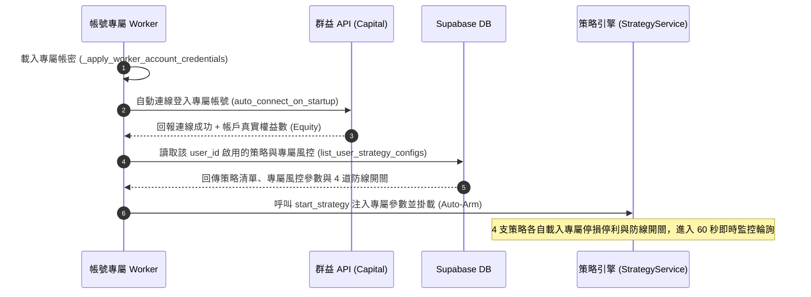
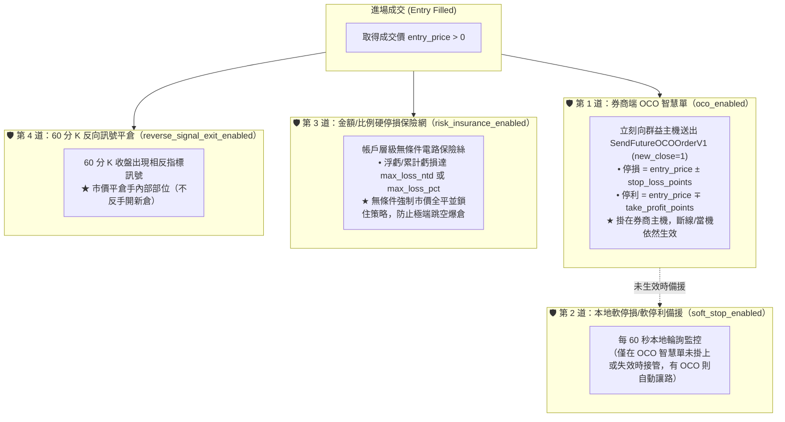

# 量化實盤架構與交易流程（2026-08-31 最新規範）

> 本文件完整記錄台指期量化系統的實際運行架構與交易流程，逐條對照 `backend/strategy_service.py`、`backend/api.py`、`backend/strategy_config_store.py` 的實際程式碼實作。

---

# 第一篇：帳號綁定與專屬配套體系 (Account Layer)

系統採用**「依帳號獨立隔離、行情資料源與下單執行分離、一體化配對專屬交易與風管配套」**的架構：

```
┌───────────────────────────────────────────────────────────────────────────────────┐
│                           👤 使用者帳號 (User Account)                             │
│       Supabase 鑑權 (JWT)  │  群益期貨獨立連線  │  專屬獨立 Worker 行程 (ACCOUNT_USER_ID)    │
└─────────────────────────────────────────┬─────────────────────────────────────────┘
                                          │ 登入後自動加載專屬配套
┌─────────────────────────────────────────▼─────────────────────────────────────────┐
│                    📦 帳號專屬交易與風管配套 (user_strategy_configs)                  │
│                                                                                   │
│  【4 支獨立方向交易策略】                 【專屬 4 道風控防線（均可獨立開關）】           │
│  ├─ breakout_long  (突破做多)            ├─ 1. 券商 OCO 智慧單 (oco_enabled)              │
│  ├─ breakout_short (突破做空)            ├─ 2. 本地軟停損備援 (soft_stop_enabled)        │
│  ├─ pullback_long  (回測做多)            ├─ 3. 金額硬停損保險 (risk_insurance_enabled)   │
│  └─ pullback_short (回測做空)            └─ 4. 60分K反向平倉  (reverse_signal_exit_enabled)│
└───────────────────────────────────────────────────────────────────────────────────┘
```

---

## 1. 帳號專屬行程與身分隔離 (Per-Account Isolation)

1. **身分驗證**：使用者透過 Supabase 登入取得專屬 JWT Token。
2. **獨立 Worker 行程 (`WORKER_MODE=1`)**：
   - 每個帳號由獨立的後端行程（Worker Process）單獨運行，透過環境變數 `ACCOUNT_USER_ID=<UUID>` 綁定特定使用者。
   - 每個 Worker 擁有獨立的群益 COM API 元件實例與獨立的記憶體狀態，不同使用者之間**資金、持倉、下單與風控完全物理隔離，互不干擾**。
3. **行情資料源與交易下單分離（Data Feed vs Execution Broker）**：
   - **行情與 K 線（Data Feed）**：全市場公開數據，由永豐 Shioaji API（讀取 `app_secrets` 的共用金鑰）與群益主報價連線負責 60 分 K 棒合成與歷史補缺，供全系統策略共享，不消耗各客戶的報價配額。
   - **下單與帳務（Order Execution）**：各 Worker 開機時從 `user_broker_credentials` 資料表載入該帳號專屬的 `CAPITAL_USER_ID / PASSWORD`；系統保證 `_load_project_env()` 與連線時 Worker 專屬帳密具有最高覆蓋優先權，絕不覆蓋回共用主帳號，確保真金白銀 100% 下在客戶自己的帳戶上。
4. **日誌與稽核紀錄分流隔離（Per-Account Log & Audit Separation）**：
   - **共用市場資料**：`data/*_60min_real.csv`（60 分 K 棒快取）、`data/raw_tick/`（逐筆行情）由全市場共享。
   - **帳號專屬日誌**：Worker 模式下自動將群益原生日誌（`capital_logs/`）、下單稽核（`order_audit.log`）、持倉稽核（`position_audit.log`）與對帳日誌（`reconcile_audit.log`）分流輸出至 `data/users/<user_id>/` 目錄，徹底避免多行程競爭 Windows 檔案鎖，確保各帳號紀錄互不污染。

---

## 2. 帳號專屬策略與風管配套表 (`user_strategy_configs`)

在 Supabase 資料庫中，每個帳號都配有一組專屬的策略與風控配置合約（`user_strategy_configs` 表）：

| 欄位名稱 | 類型 | 預設值 | 說明 | 範例 |
|---|---|---|---|---|
| `user_id` | UUID | - | 綁定的帳號識別碼 | `a1b2c3d4-...` |
| `strategy_id` | Text | - | 啟用的策略識別碼 | `breakout_long` / `pullback_short` 等 |
| `product_code` | Text | `TM2608` | 交易商品代碼 | `TM2609`（微台指 9 月） |
| `qty` | Integer | `1` | 委託口數 | `1` 或 `2` |
| `enabled` | Boolean | `false` | 是否啟用此策略 | `true`（啟用） / `false`（停用） |
| **`stop_loss_points`** | Double | `100.0` | **帳號專屬停損點數** | `80.0`（虧損 80 點強制停損） |
| **`take_profit_points`** | Double | `250.0` | **帳號專屬停利點數** | `200.0`（獲利 200 點停利了結） |
| **`max_loss_ntd`** | Double | `10000.0` | **帳號專屬金額硬停損** | `5000.0`（單日虧損達 5,000 元硬斷腕） |
| **`max_loss_pct`** | Double | `0.10` | **帳號專屬比例硬停損** | `0.05`（虧損達本金 5% 硬斷腕） |
| **`oco_enabled`** | Boolean | `true` | **第 1 道：券商 OCO 智慧單開關** | `true`（開） / `false`（關） |
| **`soft_stop_enabled`** | Boolean | `true` | **第 2 道：本地軟停損/停利開關** | `true`（開） / `false`（關） |
| **`risk_insurance_enabled`** | Boolean | `true` | **第 3 道：金額/比例硬停損開關** | `true`（開） / `false`（關） |
| **`reverse_signal_exit_enabled`** | Boolean | `true` | **第 4 道：60分K 反向平倉開關** | `true`（開） / `false`（關） |

> **管理員綁定工具**：可使用 `python scripts/bind_strategy.py --user-id <UUID> --strategy-id breakout_long --product-code TM2609 --qty 1 --stop-loss-points 80 --take-profit-points 200 --max-loss-ntd 5000 --enabled` 進行一鍵配置（亦可加上 `--no-reverse-signal-exit-enabled` 等開關旗標）。

---

## 3. Worker 啟動與自動掛載生命週期 (Auto-Arm Lifecycle)

當專屬 Worker 行程啟動時，會依序執行以下無人值守的自動掛載流程：



---

## 4. 為什麼必須有內部獨立記帳？ (StrategyState)

當同一個帳號同時啟用多支策略時（例如 `breakout_long` 與 `pullback_long` 同時做多 `TM09` 各 1 口）：

1. **券商主機的限制**：群益 API 回報的只會是合併後的淨持倉（例如「`TM09 多 2 口，均價 46100`」），券商端完全不知道這 2 口各自是哪支策略開的。
2. **各策略獨立記帳**：每支策略透過本地 `StrategyState` 各自記錄自己的持倉（`held_qty`/`held_direction`/`entry_price`），才能：
   - 依各自真正的進場成本（如 46,000 vs 46,200）精準掛出專屬的 OCO 停損停利單。
   - 出現反向訊號時，**只平掉屬於該策略自己的那 1 口**，絕不干擾其他策略的持倉。

---

# 第二篇：實盤執行與四道出場防護網 (Execution Layer)

---

## 1. 4 個獨立方向交易策略 (Trading Strategies)

| strategy_id | 策略名稱 | 方向限定 | 進場條件 | 反向出場條件 |
|---|---|---|---|---|
| `breakout_long` | 突破做多 | 只做多 | MA5 向上金叉 MA20 且 60分K 收盤確認 | 出現空方訊號時平倉（不反手） |
| `breakout_short` | 突破做空 | 只做空 | MA5 向下死叉 MA20 且 60分K 收盤確認 | 出現多方訊號時平倉（不反手） |
| `pullback_long` | 回測做多 | 只做多 | 60MA之上回測20MA不破且 60分K 收高 | 出現空方訊號時平倉（不反手） |
| `pullback_short` | 回測做空 | 只做空 | 60MA之下反彈20MA不過且 60分K 收低 | 出現多方訊號時平倉（不反手） |

- **K 棒規格**：採用 **60 分鐘 K 線**，訊號以 K 棒**收盤那一刻**為準。
- **歷史回補安全網**：背景 `shioaji_backfill.py` 每 300 秒自動回補過去 2 天歷史缺口，確保盤中重啟後均線計算完全精確。

---

## 2. 訊號確認與進場時機

1. 某根 60 分鐘 K 棒收盤時，指標計算確認產生新訊號。
2. `_latest_closed_signal()` 讀取「倒數第二根」（剛收盤確認的 K 棒）。
3. 策略背景輪詢（每 60 秒呼叫 `_tick_one`）偵測到未消費過的新訊號：
   - **立刻送出市價單（FOK / new_close=0 新倉）進場**。
   - **同向訊號不重複進場**：已有持倉時略過同向訊號。
4. **進場成交價估算（三層備援保險）**：
   - 優先：下單當下的即時報價（`quote.last_price`）
   - 次選：券商回報的實際成交均價快照（`positions[].price`）
   - 最後備援：最新收盤 K 棒的收盤價（`bars.close`）

---

## 3. 專屬於該帳號的 4 道出場與風管防護網

一旦策略進場成交，系統**立刻全面啟動以下 4 道層級分明的防護機制**：



### 4 道防線詳細規格：

1. **第 1 道：券商端 OCO 智慧單（`oco_enabled`）**
   - 進場成功且 `oco_enabled=True` 時，立刻向群益主機送出 `SendFutureOCOOrderV1` 二擇一單（帶停損與停利兩支腿）。
   - 委託嚴格指定 `new_close = 1（平倉）`，在券商端具備防呆機制，絕不會意外反手開新倉。
2. **第 2 道：本地軟停損/軟停利備援（`soft_stop_enabled`）**
   - 每 60 秒輪詢，僅在 `state.protection_order_smart_key is None`（券商 OCO 未生效）時接管送出市價平倉單。有 OCO 智慧單時主動讓路，絕不搶單。若 `soft_stop_enabled=False` 則跳過。
3. **第 3 道：金額/比例硬停損保險網（`risk_insurance_enabled`）**
   - `risk_insurance_enabled=True` 時，浮動虧損達 `max_loss_ntd`（如 5,000 元）或 `max_loss_pct`（如 5%），**無條件強制市價平倉並停用該策略**。
4. **第 4 道：60 分 K 反向訊號平倉（`reverse_signal_exit_enabled`）**
   - `reverse_signal_exit_enabled=True` 時，當 60 分 K 收盤出現相反方向訊號，若手上有多單則市價賣出平倉（空單則市價買進平倉），**只平倉、不反手**。若設為 `False` 則持倉不動、抱滿波段。

### 各層獨立開關（2026-08-31）

四道防線各自對應 `StrategyState` 的一個獨立布林欄位（`oco_enabled`／
`soft_stop_enabled`／`risk_insurance_enabled`／`reverse_signal_exit_enabled`），
可透過 `user_strategy_configs` 表依帳號/策略客製化關閉，預設全部開啟（`True`）。四層
**完全對等**，沒有任何一層是強制、不可關閉的——包含第 3 道風控保險網也可以
關掉。

⚠️ **風險**：四層全部關閉是系統允許的合法狀態，代表那筆倉位完全沒有任何
自動出場保護，只能靠人工到券商 App 或 Dashboard 手動平倉。這不是建議用法，
是刻意保留給有特殊需求的帳號的彈性，設定客製化開關前務必想清楚會不會不小心
關掉所有防護。

---

## 4. 例行對帳同步與孤兒單清理 (Reconciliation)

每輪 `strategy_tick()` 跑完所有策略檢查後，會自動執行兩項例行同步：

1. **`reconcile_after_manual_close()`（持倉同步）**：
   - 檢查券商實際淨部位。若部位已在券商端被 OCO 觸發平倉或手動平倉，則同步將本地 `held_qty` 清零。
   - **剛進場 30 秒內跳過對帳**：防止因券商持倉查詢 15 秒延遲而造成誤判。
2. **`reconcile_orphan_stop_orders()`（孤兒單清理）**：
   - 若本地部位已歸零但券商端仍殘留舊的保護智慧單，在獨立的 **30 秒安全寬限期**過後，自動向券商發送撤單請求，確保不佔用平倉額度。

---

## 5. 一鍵平倉安全防護 (Emergency Flatten)

儀表板提供「一鍵全平」（`/api/positions/flatten`）功能：
- 送出的委託單一律嚴格指定 **`new_close = 1（平倉）` + `trade_type = FOK`**。
- 若部位已在手機 App 平倉，券商主機會直接以「留倉部位不足」退單拒絕，**絕不可能重複平倉或意外反手開出全新部位**。

---

## 6. 全流程整合時序總覽

```
[帳號登入] ➔ [Worker 啟動] ➔ [自動掛載專屬策略 + 風控配套與開關]
      │
      ▼ (每 60 秒輪詢)
[60分K 收盤確認訊號] ➔ [市價進場 FOK (new_close=0)]
      │
      ▼ (entry_price > 0 且 oco_enabled=True)
[掛券商 OCO 智慧單 (new_close=1)] ──失敗──▶ [第 2 道軟停損本地頂著 (soft_stop_enabled)]
      │
      ▼ (每 60 秒即時監控)
  ├─ 觸及第 1/2 道點數門檻 (開關開啟時) ➔ 平倉出場
  ├─ 觸及第 3 道金額硬停損 (risk_insurance_enabled) ➔ 強制平倉並鎖住策略
  └─ 觸及第 4 道反向指標訊號 (reverse_signal_exit_enabled) ➔ 平倉出場（不反手）
      │
      ▼ (平倉完成後)
[例行對帳同步本地持倉] ➔ [30秒寬限期後自動撤除孤兒智慧單]
```
